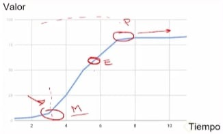
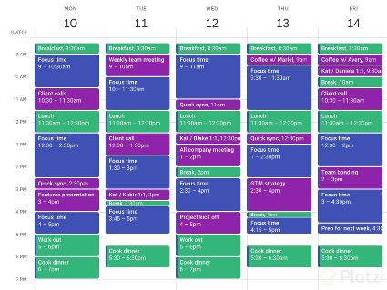

# Gestión Efectiva del Tiempo

## Introducción a la gestión del tiempo
Todos tenemos el mismo tiempo cada día y cada semana, pero parece que no todos logramos tener una gestión del tiempo tan efectiva como los demás. Es hasta normal compararse con otros y sentir que ellos hacen diez veces más que nosotros y hasta mejor. Entonces la pregunta es** ¿Cómo organizar mi tiempo y mi vida?**

La gestión del tiempo se debe enfocar en definir las tareas que debemos hacer y escoger las que no.

## ¿Como ser más productivo?
Empieza priorizando las actividades, y asignándoles los espacios de tiempos correctos. No intentes hacer todo en una mañana, o irlos postergando hasta la noche cuando ya estás cansado

Evitar hacer varias cosas al mismo tiempo. Aprende a decir “No”, esto es muy difícil para algunas personas que nos quieren decepcionar a los demás, pero parte de ser más productivo es ser más selectivo con nuestras actividades. Tampoco esperes perfección en todas tus actividades.

> Evalúa tu caso particular; deja las comparaciones y revisa las áreas de tu vida.

### ¿Cómo mejorar la gestión del tiempo?
Primero vamos a crear una estrategia enfocándonos en los objetivos que quieres lograr, y organizándolos por prioridad. Cada uno de estos objetivos, serán fragmentados en pequeños pasos que nos llevarán a alcanzar estos objetivos.

Ya que tenemos esos objetivos, les vamos a encontrar una fecha y hora para realizarlos. Toma en cuenta factores que puedan afectar tu concentración y tu energía.

Herramientas de gestión del tiempo:
- Agendas o planeadores
- Calendarios de papel
- Agendas digitales
- Apps para concentrarte

Empieza gestionando una sola parte de tu vida, no intentes gestionarla toda y calendarizarla toda de un día para otro. Los nuevos hábitos llevan tiempo.

## ¿Por qué es importante la gestión del tiempo?
En los últimos años, ha aumentado la sensación de que tenemos mucho que hacer y muy poco tiempo. El ritmo de vida de aquellos que trabajamos en tecnología es todavía más acelerado. Debemos estar aprendiendo, ejecutando e innovando, todos los días. Entonces es muy común llegar al final del día con la sensación de que no logramos nada.

## ¿Qué es el FOMO?
El término FOMO (fear of missing out), es el miedo de quedarnos fuera, de perdernos de algo. Esto ocasiona que queramos estar involucrados en muchas cosas, siempre atentos a las redes sociales y en general acostumbramos a nuestro cuerpo a estar esperando calmar ese miedo. Esto, más que hacernos productivos, nos hace procrastinar más. También ocasiona que nos comparamos con más frecuencia con otras personas y minimizamos nuestros logros, gracias a estas comparaciones.

## ¿Cómo enfocar mi tiempo?
Nuestra variable definida es el tiempo. No podemos sacarle más horas al día, y debemos respetar nuestros horarios de descanso y relajación. Lo correcto es aprender a gestionar nuestros flujos de trabajo, dándoles un orden y una prioridad óptima. Define estas metas y área en tu vida que son más importantes en este momento. Utiliza algunas de las técnicas de gestión del tiempo que más se ajuste a tus necesidades y sentirás un cambio inmediato.

## ¿Qué hacer si tengo muchas actividades pendientes?
Si empiezas a sentir que tus actividades son muchas, que no tienes el tiempo y que vas a fallar en todo, entonces debes:

-	Cambiar tus flujos de trabajo, para optimizar tus tiempos.
-	Delegar aquello que debe hacerse, pero no tienes que hacer tú.
-	Prioriza lo importante.
-	Abandonar aquello que no tiene una justificación.

Una vez que aprendas a priorizar y gestionar mejor tu tiempo, sentirás un cambio real en tu vida.

## ¿Cómo sé si soy productivo?
No podemos hablar de gestión del tiempo sin hablar de productividad. Culturalmente, se cree que una persona productiva es aquella que hace mucho, en poco tiempo. Que si puedes cerrar un trato mientras conduces y te tomas un café, entonces vas a lograr todas tus metas. Por eso surgió el término Multitask.

## ¿Qué es ser una persona multitask?
Ser multitasking o multitarea es ser una persona que puede hacer al menos dos tareas al mismo tiempo. Nuestro celular es un dispositivo multitarea, pues nos permite hacer una videollamada, mientras navegamos por internet y compartimos archivos. Pero, que nuestros aparatos lo sean, no significa que nosotros debamos serlo.

## ¿Cuáles son las desventajas de ser multitareas?
Óptimamente, deberíamos tener una agenda inicial para nuestro día, pero eventualmente surgen nuevas cosas que hacer. Esto logra desenfocarnos. Para compensar esto intentamos hacer varias cosas al mismo tiempo. Estar ocupados, no significa ser productivos, hacer mucho, no significa hacerlo bien. No gestionamos el tiempo, debemos gestionar los flujos de trabajo, las distracciones, las tareas adicionales.

## Calidad Vs Cantidad
Existe una gráfica que nos explica muy bien el cómo gastamos nuestro tiempo, que es nuestro recurso finito, en una actividad. Es decir, graficamos el valor final de nuestro trabajo en relación con el tiempo invertido.

Si realizas una actividad en poco tiempo obtienes un resultado mediocre.
Cuando gasta más tiempo del debido, eres perfeccionista.
El punto de Equilibrio es aquel donde el resultado es aceptable, en un tiempo óptimo.

## Entiéndete para organizarte

Aunque las semanas son iguales para todos, no siempre tenemos todo el tiempo a nuestra disposición. Te aseguro que no tienes dos semanas iguales en todo el año. Así es la vida en este momento, estamos sujetos a muchos cambios y nuevas tareas. Aun así, es posible encontrar ciertas tareas recurrentes que podemos optimizar, y tener mejores espacio de tiempo.

## ¿Como utilizar mejor nuestro tiempo?
Es imposible darte una fórmula mágica para organizar tu tiempo. Es necesario evaluar varios aspectos de tu vida personal, que son diferentes a los fines de semana de muchos otros.

Responde francamente a las siguientes preguntas. Reflexiona, y con calma analiza cómo es que se va comprometiendo tus tiempos efectivos de trabajo y descanso.

- ¿Cómo es una semana típica en mi vida?
- ¿En qué cosas me comprometo?
- ¿Suelo decir que sí a todo?
- ¿Comienzo una semana reconociendo qué haré o qué necesito alcanzar en la semana?

Ya que pusiste en papel y de manera clara estas preguntas, toca analizar que aspectos de tu vida necesita una mejor gestión del tiempo. ¿Cómo es el tiempo que pasas con tu familia?, ¿crees que podrías acreditar más cursos a la semana?, ¿cuánto tiempo le dedicas al autocuidado?

## Áreas de la vida
Todos tenemos diferentes áreas en nuestra vida personal a las que les debemos dedicar un tiempo, por ejemplo

- Laboral
- Familiar
- Autoaprendizaje
- Deportes

Ya con las áreas de tu vida seleccionadas, toca ponernos pequeñas metas que podamos cumplir sin hacer un gran cambio en nuestra vida.

La idea es que comiences una semana, incluso cada día, sabiendo que tareas debes hacer.

Completa el mapa de áreas de tu vida que encuentras en los recursos de esta clase.

- Elige de 3 a 5 áreas principales en tu vida.
- Piensa en 3 metas importantes en términos de tiempo que tú quieras lograr.

## Metas y áreas de mi vida

Para que podemos ver en un cambio real en nuestra productividad, necesitamos hacer ajuste en nuestra vida. Identificadas nuestras áreas a desarrollar, es necesario identificar y priorizar esas metas que queremos cumplir. Recuerda enfocarte en metas reales, útiles y con objetivos medibles

Áreas y metas de la vida
¿Qué área de tu vida quieres impulsar?

- Salud
- Relaciones
- Finanzas
- Ocio
- Espiritualidad
- Comunidad

¿Puedes definir al menos tres metas que quieras alcanzar?

## Transformar metas en actividades
Cada objetivo que tengas en la mira, puede y debe ser fragmentado en pequeños pasos que nos ayuden a lograrlo. Muchas veces estos pasos se transforman en actividades que benefician nuestro desarrollo personal en más de un aspecto. Planifica tu semana tomando en cuenta estos pasos. Es muy posible que identifiques algunas áreas de mejora y oportunidad. Siempre hay cosas que podemos hacer mejor, y otras que podemos dejar de hacer.

No caigas en la trampa de darle prioridad a actividades que no estén alineadas con tus metas. O no son tan importantes, o no tienes tus metas claras.

Es posible que este ejercicio te dé algo más de claridad sobre el cómo inviertes tu tiempo y en que lo estás enfocando.

## ¿Qué es un “Inspiración board”
Una técnica muy usada para mantenerte enfocado en tus metas, es usar una Inspiración board. Es decir, un pequeño muro, cartel, pizarra con fotos, imágenes y gráficos que te ayuden a recordar esas metas, objetivos y cambios que quieres en tu vida.

Al tener claridad en relación con las actividades específicas para lograr tu objetivo, les debes poner fecha y deben hacer parte de tu agenda. 📔

### Archivos de clase 

[Convirtiendo a actividades](/Arcivos_de_Enlace/clase-4_-convirtiendo-a-actividades_f83cbdf5-de9a-4ca1-a9d3-31361b6287b4.docx)

## Priorización de tareas

Hay un dicho que dice “Cuando todo urge, nada urge”. Debemos saber identificar cuáles de nuestras actividades son importantes y cuáles son urgentes.

Utiliza criterios de priorización para determinar qué actividades realizar primero.

- Urgentes: requieren tu atención inmediata, requieren nuestra atención y tienen fecha de entrega.
- Importantes: tienen un objetivo y producen resultados tangibles
- Urgentes e importantes: son temas importantes, pero que tuvieron poca planeación y no alcanzaste ejecutar en el momento adecuado.
- Urgentes y no importantes: actividades que debes efectuar inmediatamente. Son actividades que no están alineadas con un objetivo o meta, pero se convirtieron en urgentes.
- No urgentes e importantes: son actividades con objetivos y metas con los tiempos adecuados para desarrollar sus procesos. Ahí deberían estar todas tus tareas en etapa de planificación.
- No urgentes y no importantes: son tareas que pueden ser divertidas, pero hacen que pierdas tiempo. ¡Elimínalas!

## Matriz de criterios de priorización
Puedes crear una matriz de criterios de priorización para ayudarte en esa tarea.

Recuerda la regla de Pareto: Verifica si 20% de las actividades que haces producen el 80% de los resultados.

### Archivos de la clase

[Matriz de administración de tiempo](./Arcivos_de_Enlace/matriz-de-administracion-del-tiempo_5a34da12-79df-49e9-ba0d-f12610a116ee.docx)

## Administración de tareas compartidas

Existen tareas que nosotros realizamos con total autonomía, otras donde dependemos de los demás y un tercer tipo donde nuestra tarea tiene una responsabilidad compartida con un tercero que depende de nosotros. Son estos últimos dos casos los que son más susceptibles de ser fuentes de conflictos, retrasos y problemas.

El seguimiento de actividades puede ser fuente de conflicto, y por desgracia, también son distractores que nos quitan tiempo a ambas partes.

## Cómo organizar tareas compartidas

• Delega los correos, llamadas de actualización y seguimiento.
• Otorga una prioridad adecuada a las actividades compartidas.
• Analiza si vale la pena delegar la actividad.
• Busca un cambio de colaboradores, si estos no están cumpliendo con los tiempos y formas.
• Cumple con los tiempos de tus entregas, para evitar gastar tiempo tuyo y de los demás.

## Estrategias para realizar seguimiento

Adicional a estar atento a lo que debes entregar a otras personas y lo que tienes pendiente por recibir, es importante que estas actividades las hagas de una forma organizada e intencional. Que manejes algún sistema definido, que sea sencillo y que no tengas que dedicarle mucho tiempo extra, será clave para sacarle provecho a tu tiempo y el de otros.

## Procrastinación e indecisión

Existen tareas que debemos hacer, pero que preferimos darle prioridad a otras, que posiblemente no la tiene. Hay veces que postergamos tanto un trabajo, que el tiempo termina comiéndonos. Todos tenemos experiencias así, donde hemos perdido el tiempo útil que teníamos apara una tarea, en otras tareas secundarias totalmente irrelevantes. Existen maneras de combatir este enemigo imaginario que sabotea nuestras agendas que se llama procrastinación.

¿Qué es la procrastinación?
Cuando aplazamos las tareas que debemos hacer, y realizamos otra tarea de menor importancia o urgencia, estamos procrastinando. Esto es muy claro cuando prefieres cualquier otra tarea, a la que deberías estar haciendo.

Estas actividades muchas veces son actividades que, en otras circunstancias normales, jamás hubiera considerado hacer, como limpiar el escritorio a profundidad.

## ¿Cómo evitar procrastinar?

- Es posible optimizar tu tiempo, cuando identificas a tus distractores habituales, como puede ser una persona en especial, un programa de televisión, o una actividad de ocio.
- Busca activamente eliminar las interrupciones que evitan que logres llegar a tu punto de mayor enfoque. Ya sea con una recalendarización a un tiempo más óptimo o con medidas más extremas, como desconectarte por completo de las redes sociales.
- Enfrenta tus tareas, la mejor manera de no tener que hacer algo, es ya habiéndolo hecho.
-  Reconoce cuáles son tus ladrones de tiempo. Al identificar actividades o personas que llaman tu atención, elimina las distracciones.

## Aumenta tu concentración

La metodología GTD - Get things done te ayuda a concentrarte en la tarea que tienes que hacer.

Pon todas las tareas que debes hacer en un papel y sigue esta lista con disciplina. Utiliza las preguntas para evaluar las tareas:

- ¿Puedo borrarlo sin hacer nada?
- ¿Es información que debo guardar como referencia?
- ¿Puedo delegarlo en alguien?
- ¿Puedo hacerlo inmediatamente en menos de 2 minutos?

## Claves para decidir sobre tu tiempo

No podemos agregarle más horas al día, pero si podemos crear estrategias para que ese tiempo sea mejor aprovechado. Gestiona efectivamente tu tempo, es más un cambio de mentalidad, que un cambio de ambiente.

10 Consejos para hacer más cosas en menos tiempo
Estos consejos tienen como objetivo ayudarte a enfocar en las tareas que merecen tu tiempo, agendarles u tiempo exclusivo y óptimo, además de recompensarte por terminar tus tareas

- Recuerda que sí hay suficiente tiempo.
- Implementa las 3 C: calma, claridad y conexión.
- Tómate pausas entre tareas.
- Aparta espacio para planear.
- Procura cerrar pendientes.
- Piensa en el beneficio de cada actividad.
- Toma decisiones (por ti mismo o misma).
- Define cuánto tiempo dedicarás a cada tarea.
- Recuerda que planear no es lo mismo que llenar una agenda.
- Escribe tus logros al terminar el día.

8 hábitos que debes eliminar
- No digas sí a todo.
- No trabajes de más.
- No te pongas metas poco realistas.
- No caigas en distracciones.
- No te estanques en actividades innecesarias.
- No hagas multitasking.
- Evita malos hábitos de alimentación.
- Evita el desorden en tu espacio de trabajo.

El autoconocimiento es muy importante para poder entender realmente que cosas son la que nos quitan el tiempo y como reaccionamos ante la urgencia o no urgencia de las actividades.

## Fechas de entrega vs. fechas de realización
Hablemos de la diferencia entre fechas de entrega y fechas de realización. De nada sirve poner la fecha de entrega, si no hemos apartado espacio en nuestra agenda para realizar esta tarea. Debemos enfocarnos en la diferencia entre cuando debe ser hecho y cuando entregado. Tenemos muchas pequeñas actividades que cumplen con esta tarea y es en ellas en las que nos debemos enfocar

## ¿Cómo cumplir con una meta a largo plazo?
Supongamos que tienes que hacer un producto de uso diario, por ejemplo un champú. Nuestro cliente lo quiere en las tiendas en febrero del próximo año. Para que esto sea así, primero debemos cuantificar cuanto es el tiempo de distribución desde la bodega a la tienda. Antes de que se sea llevado al almacén, necesita una semana de fabricación, y esa orden necesita una semana de preparación. Para poder preparar el producto necesitamos envase, etiquetas y el líquido, que muy posiblemente vengan de tres proveedores diferentes. Entonces debemos tener en cuneta el tiempo de anticipación que requieren nuestros proveedores para efectuar su entrega y así sucesivamente.

Como puede ver, lo que define si podemos cumplir o no con una entrega, no es la fecha de entrega, más bien debemos enfocarnos en las pequeñas fechas y tiempos que requieren las etapas anteriores.

Back to Future, o línea regresiva, es una herramienta que te permite programar la fecha de realización de todas las tareas pequeñas que componen una meta a largo plazo, analizando en reversa a partir de la fecha de entrega de la meta final. Así, puedes proyectar la fecha en que debes comenzar con la primera tarea de todas y programar todas las fechas en que debes terminar las tareas de corto plazo.

> No agendes una fecha de entrega, agenda las tareas que necesitan ser hechas para realizar esa entrega.

## ¿Cuántas horas tiene una semana?

Comenzamos la semana, la mayoría de las veces, sin tener una idea clara de la cantidad de cosas que debemos alcanzar esa semana, o la disponibilidad de tiempo que realmente tenemos. No importa que herramientas utilices para organizar tu tiempo, lo importante es que tengas una metodología clara para organizar y priorizar tus actividades semanales. Para esto puedes apoyarte de una gran cantidad de herramientas digitales y físicas. No importa cuáles uses, mientras se ajusten a tus necesidades y te ayuden a planificar de manera consistente tus semanas.

Cosas que debes incluir en la planeación de tu semana: 
- Citas con fechas
- Tiempo libre, hobbies
- Seguimiento a procesos
- Fechas de entrega
- Recordatorios
- Actividades específicas
- Horas de entrada y salida

El trabajo es fundamental, pero también las horas familiares y de descanso, recuerda que incluirlas es una manera de evitar caer en la procrastinación.

## ¿Cómo es la técnica de Time blocking?
Consiste en dividir toda tu semana en bloques de tiempo destinados a actividades específicas inmutables. Aquí vamos a organizar todos y cada uno de los aspectos de nuestra vida y emplearemos toda nuestra fuera de voluntad para cumplir con estas tareas en sus tiempos. Una de sus desventajas es que deja poco espacio para la improvisación, los retrasos y las actividades inesperadamente largas.

 

## Técnicas de control del tiempo

Uno de los temas principales a la hora de organizar tu tiempo y ejecutar los compromisos propuestos, es tener una buena metodología que te permita enfocarte y medir los tiempos que dedicas a las tareas y actividades priorizadas. Para esto, quiero mostrarte dos de las metodologías más conocidas en términos de enfoque y concentración que te invito a probar y a comentar con cual te sientes mas cómodo(a).

## Herramientas análogas

Aunque todos tengamos a nuestra disposición algún dispositivo móvil, no podemos negar que las ideas en papel, escritas con nuestro puño y letra, son mucho más fuertes y perdurables. Existen muchas maneras de manejar nuestra información de manera analógica.

## Cómo organizarte con papel y lápiz
Cuaderno
El cuaderno es la herramienta de toda la vida para organizarte. Te permite manejar listas de tareas, recordatorio y todo tipo de explicaciones amplias. Su temporalidad es muy amplia y es muy fácil de transportar a otros lugares.

Agenda
Te abre una visión por día y también de un año completo. Sirve como un registro cronológico perfecto. Te deja hacer anotaciones amplias y revisar sobre lo ejecutado. Tiene un buen alcance hacia el futuro: te deja programar tareas para fechas específicas. Sus tamaños de bolsillo y diferentes presentaciones son muy prácticas.

Planeadores
Te da una visión general de tu semana completa en una sola vista. Te deja hacer anotaciones muy cortas y te permite enfocarte en un periodo específico (1 semana a la vez). Pueden ser de tamaño de una hoja o puede ser un pizarrón en una pared. Nos sirven muy bien para ver sucesiones de eventos y para eventos recurrentes.

Notas adhesivas
Te permiten hacer anotaciones o recordatorios rápidos. Como quedan en un únicamente sitio, deben ser notas muy específicas. No son planificadores, son para datos, anotaciones y recordatorio no tan importantes. Son más bien un complemento de otros tipos de planificadores, agendas y tableros.

Tableros
Te permiten anotar tareas específicas de rápida acción. Te proporcionan información a la que necesitas acceso rápido, como correos o números de teléfono. Están pensados más en equipos y eventos puntuales que en ser una manera de organizar. Es información de referencia y de interés para todo el equipo de trabajo.

Es posible y hasta recomendado complementar un tipo de organización con otros y hasta mezclarlo con herramientas tecnológicas y aplicaciones que sirvan para este fin. Descubre de que manera te organizas mejor, no tengas miedo de cambiar una y otra vez de metodología, hasta que logres encontrar lo que se te acomoda.

## Herramientas digitales

Todas las herramientas análogas de organización tienes sus similares digitales. Encontrar tu manera de organizarte puede significar el mezclar unas y otras maneras de anotar y priorizar tus tareas. La gran ventaja de estas herramientas no solo radica en su portabilidad, también en las opciones de que son más agradables visualmente, y que se pueden sincronizar entre dispositivos y usuarios.

Organizadores Digitales que debes probar
Agendas
Son perfectas para programar tus tareas, citas, invitaciones y notificaciones en general en manera de bloques diarios y semanales.

Recordatorios
Existen todo tipo de aplicaciones que nos avisan, mediante notificaciones o sonidos, a ciertas y especificas horas que es lo que debemos hacer. Son muy útiles para eventos semanales, rutinas diarias, como tomar medicamentos a ciertas horas, específicas. Esta tecnología no tiene símil en las herramientas análogas

Notas
Las apps de notas son apps que te permiten sincronizar listas de tareas, datos simples y listas de tareas entre dispositivos y entre usuarios.
Permite realizar búsquedas rápidas, aunque tengamos una gran cantidad de información.

Método Kanban
Organizarte con tarjetas que nos clasifiquen nuestras tareas de acuerdo a su estado de realización, es muy fácil con herramientas como Notion o Trello o Asana. Su interactividad nos da un sentimiento de satisfacción cada que podemos actualizar nuestro progreso. Además, muchas de e

Apps de bloqueo
Parte importante de aprender a ser productivos, es aprender a no tener distracciones. Tenemos varias opciones para que nuestros dispositivos no nos estén notificando de nada de lo que pasa en nuestras redes por ciertos periodos de tiempo que podemos ajustar, por ejemplo si trabajáramos con una técnica pomodoro.

Concentración
Pero, si además de evitar notificaciones, nos dan una pequeña recompensa por no estar perdiendo el foco de concentración, entonces estamos hablando de otro tipo de app que nos permite alejarnos de las distracciones.

## Emociones y tiempo libre

Dos temas muy importantes son las emociones y el tiempo libre. Es fundamental también planear tu tiempo libre. Esto quiere decir que el tiempo libre no es el que nos “sobra”, sino un tiempo que separamos para desarrollar nuestros intereses y relaciones. La mente debe recargarse con actividades que disfrutemos, esto generará emociones positivas y estimulará tu creatividad, lo que también contribuirá con tus actividades de trabajo o estudio.

Productividad emocional
Cuando eres constante y disciplinado, tienes una satisfacción que puede ser un detonante emocional muy fuerte. Ya sea por la satisfacción que nos genera o por la angustia que surge de no cumplir con horarios y metas. Parte de lo trascendente de planear, es calmar los pensamientos intrusivos que nos afectan productivamente.

No es realista querer ser productivos el 100% del tiempo. Los hobbys, las fiestas, los viajes y hasta ratos de ocio son necesarios para poder evitar caer en burnout y todo tipo de sobrecargas emocionales.

¿Cómo afectan tus emociones al manejo que le damos al tiempo?
Es común que tengamos pensamientos recurrentes, aquellos que vienen a nuestra mente una y otra vez. Es fundamental que ajustemos estos pensamientos de tal forma que sean positivos y nos ayuden en el cumplimiento de nuestras metas.

Existen pensamientos que logran lo contrario, por ejemplo: “para qué empiezo ahora, si ya no alcanzo a terminar”. La clave está en combatir estos pensamientos con acciones. Iniciar lo que nos proponemos puede costar un poco, pero una vez lo hacemos, es mucho más sencillo darle continuidad a nuestras actividades.

El tiempo libre también se planea
Ponte citas contigo mismo para hacer eso que te gusta. Agenda ratos de diversión, procura tener tus horas de sueño completas. Esto forma parte de los rituales de autocuidado que tenemos muy delegados, porque no parecen estar alineados a nuestras metas. No te sientas culpable por divertirte, al contrario, reconoce su importancia para enriquecer tu pensamiento y ampliar tu visión del mundo. Aprende a planear inteligentemente tu tiempo libre y verás el cambio que esto genera en tu vida.

## Transporte y cumplimiento de compromisos

Por más que hemos aprendido a realizar home office, muchas de nuestras tareas tiene que hacerse en ciertos lugares específicos, por ejemplo ir por los niños a la escuela. En tu agenda debes agregar el tiempo de espera y traslado, desde la puerta de donde sales, hasta el punto exacto a donde vas a llegar. Todos estos tiempos muertos deben considerarse como parte de la tarea y se deben considerar posibles retratos. Hacerlo de otra manera sería hasta negligente de nuestra parte.

### ¿Qué es una ruta crítica?
Cuando programamos nuestras actividades buscando aprovechar los mejores tiempos, para las tareas más necesarias, estamos trazando una ruta critica.

Para trazar una buena ruta crítica debemos seguir los siguientes pasos.

### Valora la importancia de las reuniones.
No todos tiene que ser una reunión, hay veces que el tema tan simple que puede ser una llamada o un correo. Si vas a planear una reunión, intenta que sea realmente necesaria.

### Buscar opciones
No todas las reuniones tiene que ser presenciales. Busca otras opciones como Zoom. De la misma manera, considera que para algunas tareas es más fácil delegar una tarea y hasta usar algún servicio de mensajería que te ahorre ese tiempo

### Orden de trayectos
Aun cuando vamos a hacer la compra, si llevamos una lista con lo que necesitamos comprar y lo organizamos por el mejor trayecto, no solo estamos ahorrando tiempo, también dinero.

## La importancia de los compromisos
- Responsabilidad con otros: Cada cita que hagamos, debe ser cumplida.
- Respetar el tiempo de otros: Valoremos el tiempo que los otros apartan para nosotros
- Horas de llegada: Respeta los tiempos asignados, por ti y por los otros.
- Honor a la palabra: Nuestra palabra es algo tan valioso, que no tiene precio.
- Atención sostenida: Si ya prometiste tu tiempo, dalo entero. Sin distracciones

## Aprende a decir NO
Decir que sí, a todo, es una gran defecto que muchos tenemos. Acepta cuando no estás en posibilidades de cumplir una nueva tarea. Rechaza reuniones que no son necesarias. El tiempo es algo muy importante, aprecia el tuyo y muestra respeto por él los otros.

## Optimizar el proceso para alcanzar resultados

Quiero que te hagas una pregunta muy importante.

> ¿Cuándo organizas tu tiempo o te enfrenta a una tarea, te enfocas en tener rápido el resultado, o disfrutas el proceso?

Hay que buscar donde está la motivación principal al momento de realizar una tarea. Debemos entender que cada actividad es un proceso que hay que disfrutar nuestro paso por cada una de las etapas. El diploma no es la meta, es solo la finalización de un proceso de aprendizaje. El papel no sirve de nada si no nos quedamos con los aprendizajes esperados de todo el curso.

¿Cómo obligarte a hacer algo que no quieres?
No siempre podemos disfrutar de todas nuestras tareas. A veces no queremos llenar informes o hacer reportes tediosos que sabes que nadie va a leer, pero que deben hacerse. Si no podemos delegar esta tarea y sufrimos cada que debemos ejecutarla, podemos recurrir a alguno de estos consejos.

- Divide y vencerás: Toda tarea puede ser dividida en pequeñas sub tareas. Aunque no las anotes tan cuál en tu agenda, si es posible que si te programas para hacer primero las subtareas que menos te desagraden.

- Simplifica el trabajo: Analiza como has estado haciendo las cosas y busca maneras de innovar, que sean más efectivas y más rápidas.

- Cambia tu forma de trabajar: Es posible que, después un tiempo haciendo una misma tarea, puedas encontrar mejores maneras de llevar a a cabo esos procesos.

- Pregunta: Es muy posible que no seas la única persona que tiene que hacer esta tarea. Platica con personas con un puesto o tareas similares y pídeles que te cuenten como logran organizarse. Tu mismo puedes darles algunos de tus trucos e ideas.

- Pide ayuda: Nunca tengas miedo de decir “esto me está sobrepasando”. Es muy válido acercarte a otras personas y pedirles que te orienten para tener mejores prácticas y enfoques.

## Caso de éxito personal

Si empezamos siendo personas organizadas en nuestra vida diaria, será más fácil poder lograr tener un ambiente de trabajo organizado y llevar a cabo tareas de alta responsabilidad.

## Organización personal y gestión del tiempo
cuando trabajas en temas de logística aprendes la importancia de ser una persona organizada que pueda llevar un buen registro del tiempo, de lo que se necesita para llevar un proceso, cuando llegaron las cosas a inventario y cuando fueron despachados.

Las actividades que requieren de gran logística nos enseñan muchas lecciones sobre el manejo del tiempo. Tendremos muchos plazos por cumplir, así como recordatorios. Debemos ver estos como una ayuda a nuestro trabajo y no como una angustia generadora de estrés.
La planeación detallada es fundamental. Especialmente en situaciones en donde una parte del proceso sale mal, ya que si todos los demás pasos están bien estructurados, podremos enfocar nuestra atención en la tarea que más lo requiere.

Todo en el mundo de los negocios tiene que ver con horas, fechas y metas por cumplir. El sistema de organización debe ser un medio de calma, no de angustia.

## Recomendaciones para seguir aprendiendo a gestionar el tiempo

La mejor manera de encontrar nuestro máximo potencial, es conociéndonos a nosotros mismos. Cuando entendemos como es que respondemos ante las tareas que no nos gustan, o si para nosotros las herramientas análogas son mejores que las digitales, entonces es cuando realmente podemos conseguir un cambio.

## Autoconocimiento y organización.
Recomendaciones para el manejo efectivo del tiempo:

- Conócete a ti mismo. ¿Qué te motiva?, ¿qué te distrae?: Cuando identificamos nuestros puntos fuertes y los puntos débiles, somos más conscientes de ellos y es más fácil sacarles provecho.
- Sé persistente y resistente. La mejora continua de nuestros procesos y sistemas de organización es una lucha de todos los días.
- Sé flexible. Acepta los cambios de planes, de tareas y manera de hacer las cosas
- Evalúa tus días o semanas para saber qué tanto has avanzado hacia tus metas. Los pequeños progresos, sin un aliciente para seguir haciendo las cosas.
- Facilita un ambiente propicio para el trabajo o el estudio. Aprende a eliminar distracciones, como las Redes Sociales, y busca tus mejores horas para enfocarte en los trabajos pesados.
Contribución creada con aportes de: Mayra López.